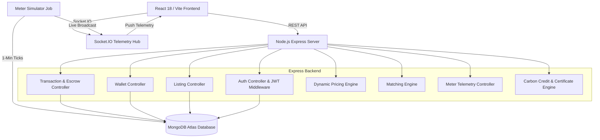
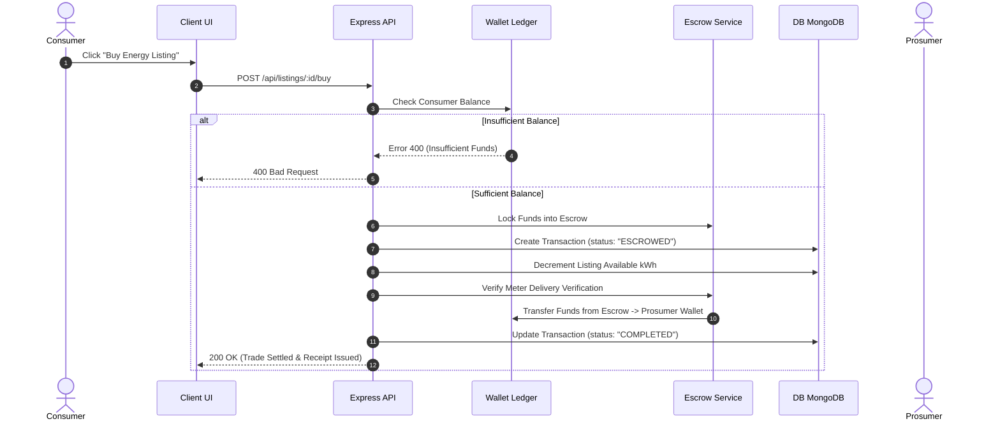

# SolarShare — System Architecture & Technical Blueprint

> **System Blueprint Version:** 1.0.0  
> **Pattern:** Decoupled Client-Server Micro-Services / Modular Monolith Architecture  

---

## 1. High-Level Architectural Overview

SolarShare employs a decoupled architecture separating the client layer, backend API server layer, real-time telemetry engine, and data storage infrastructure.

```
+-----------------------------------------------------------------------------------+
|                                 CLIENT LAYER                                      |
|  React 18 + Vite | Tailwind CSS | Socket.IO Client | Recharts | Context API       |
+-----------------------------------------------------------------------------------+
                                         |
                       HTTP / REST APIs  |  WebSockets (WS)
                                         v
+-----------------------------------------------------------------------------------+
|                                 SERVER LAYER                                      |
|  Node.js + Express.js | JWT Auth | Socket.IO Server | Order Matching Engine       |
+-----------------------------------------------------------------------------------+
                                         |
                    Mongoose ODM         |  Meter Simulation Engine
                                         v
+-----------------------------------------------------------------------------------+
|                                 DATA & INFRASTRUCTURE                             |
|  MongoDB Atlas (NoSQL) | Render (Server Hosting) | Vercel (Client Hosting)        |
+-----------------------------------------------------------------------------------+
```

---

## 2. Component Layering & Subsystems



---

## 3. Core Operational Workflows

### 3.1 P2P Trade & Escrow Settlement Sequence



---

## 4. Module & Directory Structure Blueprint

The codebase enforces strict modularity with single-responsibility components capped at **100 LOC per file**.

```
SolarShare/
├── client/                              # React Frontend
│   ├── src/
│   │   ├── api/                         # Axios HTTP instances
│   │   ├── components/                  # UI Components (Sidebar, StatCard, etc.)
│   │   ├── context/                     # Global State (AuthContext, ThemeContext)
│   │   ├── pages/                       # Screen Views (Admin, Consumer, Prosumer)
│   │   └── utils/                       # Frontend Formatters & Calculations
├── server/                              # Node.js Express REST Server
│   ├── config/                          # DB Mongoose connection & Seeder
│   ├── controllers/                     # Lean HTTP Controllers (<100 LOC each)
│   ├── middleware/                      # Auth JWT & RBAC guards
│   ├── models/                          # Mongoose Schemas (User, Listing, Wallet, etc.)
│   ├── routes/                          # Express Router definitions
│   ├── services/                        # Business Logic (MeterSimulator, MatchingEngine)
│   └── utils/                           # Token Generators & PDF Printers
```

---

## 5. Technology Selection Rationale

| Domain | Technology | Key Selection Rationale |
| :--- | :--- | :--- |
| **Frontend Framework** | React 18 + Vite | Fast HMR development, lightweight bundle, declarative state rendering. |
| **Styling** | Tailwind CSS | Utility-first styling for glassmorphism, responsive grid, and custom dark mode themes. |
| **Data Viz** | Recharts | High-performance SVG-based charts for energy generation time-series rendering. |
| **Backend Runtime** | Node.js (v20+) | Event-driven non-blocking I/O ideal for concurrent IoT meter events and HTTP requests. |
| **Web Server** | Express.js | Unopinionated, robust HTTP middleware architecture. |
| **Real-time Comms** | Socket.IO | Automated fallback (WebSockets to Long Polling), room subscriptions per prosumer. |
| **Database** | MongoDB Atlas | Flexible JSON document model matching time-series meter data and transactional records. |

---

## 6. Real-Time Telemetry & Event Architecture

1. **Simulator Tick Loop:** A background cron service (`meterSimulator.js`) runs continuously at 60-second intervals.
2. **Data Generation:** Calculates output based on solar capacity, time of day (sine curve simulation), weather randomness, and battery state.
3. **Storage & Broadcast:** Saves a `MeterReading` document to MongoDB and emits `meter:update` WebSocket payload to connected clients.
