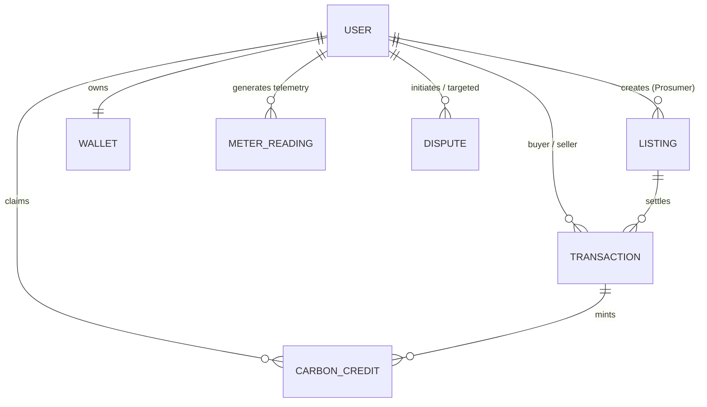

# SolarShare — Database Schema & Data Models Specification

> **Database Engine:** MongoDB Atlas / NoSQL Document Store  
> **ODM:** Mongoose 8.x  
> **Schema Version:** 1.0.0  

---

## 1. Entity-Relationship Overview



---

## 2. Collection Schemas

### 2.1 User Collection (`users`)
Stores platform identity, credentials, roles, solar capacity, and KYC verification attributes.

```js
{
  _id: ObjectId,
  name: String,            // Required, trimmed
  email: String,           // Required, unique, lowercase
  password: String,        // Hashed via bcrypt (10 rounds), select: false
  role: String,            // Enum: ["prosumer", "consumer", "admin"]
  phone: String,
  address: {
    line1: String,
    city: String,
    state: String,
    pincode: String
  },
  solarPanel: {
    capacityKw: Number,   // Default: 0
    installedOn: Date,
    panelModel: String
  },
  walletBalance: Number,   // Default: 0
  carbonCreditsTotal: Number,
  isVerified: Boolean,     // Default: false
  isBlocked: Boolean,      // Default: false
  aadhaarNumber: String,
  panNumber: String,
  bankDetails: {
    accountNo: String,
    bankName: String,
    ifsc: String
  },
  createdAt: Date,
  updatedAt: Date
}
```

---

### 2.2 Listing Collection (`listings`)
Stores energy offers listed by prosumers on the marketplace.

```js
{
  _id: ObjectId,
  seller: ObjectId,        // Ref: "User"
  availableKwh: Number,    // Required, min: 0
  pricePerKwh: Number,     // Required, min: 0
  status: String,          // Enum: ["active", "sold_out", "expired", "cancelled"]
  availableFrom: Date,     // Default: Date.now
  availableUntil: Date,
  location: {
    lat: Number,
    lng: Number,
    city: String
  },
  createdAt: Date,
  updatedAt: Date
}
```

**Indexes:**
- `{ status: 1, pricePerKwh: 1 }` (Marketplace query acceleration)

---

### 2.3 Transaction Collection (`transactions`)
Records energy purchases, financial transfers, escrow locks, and trade settlement.

```js
{
  _id: ObjectId,
  buyer: ObjectId,         // Ref: "User"
  seller: ObjectId,        // Ref: "User"
  listing: ObjectId,       // Ref: "Listing"
  kwh: Number,             // Quantity purchased
  pricePerKwh: Number,     // Lock price at time of purchase
  totalAmount: Number,     // kwh * pricePerKwh + platformFee
  platformFee: Number,     // Platform service fee
  status: String,          // Enum: ["ESCROWED", "COMPLETED", "REFUNDED", "DISPUTED"]
  settledAt: Date,
  createdAt: Date,
  updatedAt: Date
}
```

---

### 2.4 Wallet Collection (`wallets`)
Maintains isolated digital balances, pending escrow funds, and transaction ledgers.

```js
{
  _id: ObjectId,
  user: ObjectId,          // Ref: "User", unique index
  balance: Number,         // Available liquid funds
  escrowBalance: Number,   // Funds locked in active trades
  currency: String,        // Default: "INR"
  history: [
    {
      type: String,        // Enum: ["DEPOSIT", "WITHDRAWAL", "ESCROW_LOCK", "ESCROW_RELEASE", "REFUND"]
      amount: Number,
      description: String,
      timestamp: Date
    }
  ],
  createdAt: Date,
  updatedAt: Date
}
```

---

### 2.5 MeterReading Collection (`meterreadings`)
Time-series data store for IoT smart meter telemetry simulation ticks.

```js
{
  _id: ObjectId,
  user: ObjectId,          // Ref: "User"
  generationKw: Number,    // Instantaneous generation rate (kW)
  consumptionKw: Number,   // Instantaneous consumption rate (kW)
  gridVoltage: Number,     // Grid voltage reading (e.g. 230V)
  cumulativeKwh: Number,   // Total cumulative energy
  timestamp: Date,         // Ingestion timestamp
  createdAt: Date
}
```

**Indexes:**
- `{ user: 1, timestamp: -1 }` (Time-series telemetry retrieval)

---

### 2.6 CarbonCredit Collection (`carboncredits`)
Tracks minted Renewable Energy Certificates (RECs) derived from verified solar sales.

```js
{
  _id: ObjectId,
  prosumer: ObjectId,      // Ref: "User"
  transaction: ObjectId,  // Ref: "Transaction"
  co2OffsetKg: Number,     // Derived: kwh * 0.85 kg
  creditToken: String,     // Unique cryptographic certificate token
  status: String,          // Enum: ["MINTED", "CLAIMED", "RETIRED"]
  issuedAt: Date,
  createdAt: Date
}
```

---

### 2.7 Dispute Collection (`disputes`)
Tracks trade conflicts filed by consumers or prosumers.

```js
{
  _id: ObjectId,
  transaction: ObjectId,  // Ref: "Transaction"
  initiator: ObjectId,    // Ref: "User"
  respondent: ObjectId,   // Ref: "User"
  reason: String,         // E.g. "Meter reading discrepancy", "Non-delivery"
  description: String,
  evidenceUrl: String,
  status: String,          // Enum: ["OPEN", "UNDER_REVIEW", "RESOLVED", "REJECTED"]
  resolution: String,
  arbitratedBy: ObjectId, // Ref: "User" (Admin)
  createdAt: Date,
  updatedAt: Date
}
```

---

### 2.8 PricingSetting Collection (`pricingsettings`)
Stores administrative dynamic tariff rules and DISCOM baseline tariffs.

```js
{
  _id: ObjectId,
  discomBaseRate: Number,   // Baseline grid rate (e.g. 8.00 INR/kWh)
  minPriceFloor: Number,    // Minimum allowable seller price (e.g. 3.50 INR/kWh)
  maxPriceCap: Number,      // Maximum allowable seller price (e.g. 7.50 INR/kWh)
  surgeMultiplier: Number,  // Peak load multiplier (default 1.0)
  updatedBy: ObjectId       // Ref: "User" (Admin)
}
```
